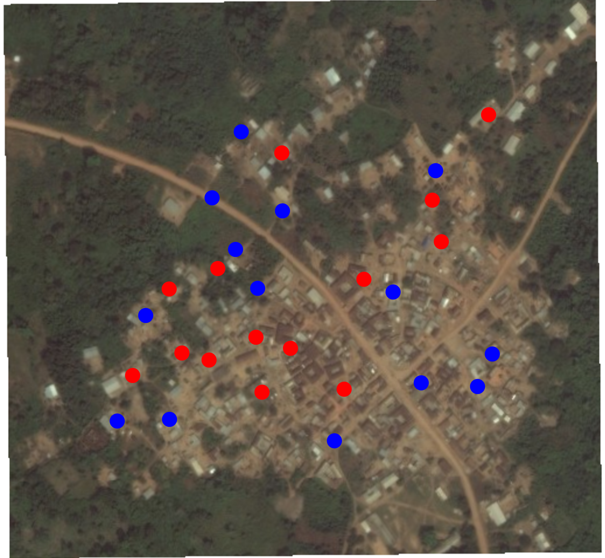

<!-- To show notes  -->
<!-- https://stackoverflow.com/questions/44906264/add-speaker-notes-to-beamer-presentations-using-rmarkdown -->

```{r echo=FALSE, include=FALSE, cache=FALSE}
library(here)
source(here::here("Exercises/rmd_setup.R"))
library(tidyverse)
library(DeclareDesign)
library(coin)
library(kableExtra)
```

# Overview and Review

## Overview of the class {.allowframebreaks}

**At the end be able to answer questions like:**

- **Why choose a randomized experiment?** <!-- What are the benefits of randomized experiments? When might we want to
  randomize and when might we not want to randomize?  -->
- **What is a counterfactual
  quantity and why might we care about this?**
<!-- What are we trying to learn about from a randomized experiment? (Typically.)
  How does calculating averages within an experimental pool help us learn about
  unobserved counterfactual quantities? How do hypotheses tests also help us
  learn about unobserved counterfactual quantities?  -->
 - How can we randomize using R?
 - **Why test? Why estimate? How test and estimate? What is randomization based inference and why should we care?**
 How can we use R to test hypotheses about
   counterfactual quantities? How can we use R to estimate average causal
   effects (differences of averages of counterfactual quantities)?
 - How might we know when it is worth randomizing and when it is not?
   (Statistical power) **What is statistical power? Why should we care?**
 - How should we make choices about certain common designs:
   - Why might one randomize within strata? What does this imply for analysis and
   interpretation?
   - Why might one randomize an intervention to groups or clusters of units? What
   does this imply for analysis and interpretation?
   - How might we use randomization to learn about the effects of interventions
  even when we cannot control who receives a full dose of the treatment?
  (LATE/CACE)

<!--
## Overview of the class {.shrink}

- We **infer** about counterfactual causal mechanisms by **estimating** and
  **testing**: *Causal inference (in this class) requires statistical
  inference.*
- Statistical inference requires **distributions** (we cannot know whether an
  estimator is unbiased without an idea of a distribution, we cannot calculate
  a $p$-value without a distribution, etc.)
- Distributions require **thought experiments** about repetition: We  *imagine*
  that we could (a) re-draw random samples from a the same population or (b)
  re-assign randomized treatment. (We can also imagine reusing our priors and
  likelihood.)
- We will use the fact that distributions of certain test statistics is **known
  for randomized experiments** to (a) answers questions about whether this
  research design answers the questions we want or not and  (b) analyze outcomes.
-->

##  Today

  1. Why experiment?
  2. Causal inference in randomized experiments and the idea of only partially
   observed **potential outcomes**. The idea that we can use what we observe to
   learn about what we cannot observe.
  3. Statistical inference for causal effects in randomized experiments via the
     Fisher and Neyman approaches \autocite[Chap 2]{rosenbaum2010},
     \autocite[Chap 1-3]{gerbergreen2012}: Estimation, Estimators, Tests,
     Testing.

Note: You can download (and contribute to) course materials at [https://github.com/bowers-illinois-edu/short_course_experiments](https://github.com/bowers-illinois-edu/short_course_experiments)


## Overly Ambitious Plan for the day

 - Introduction to Jake
 - Introduction to the idea of the course: roadmap
 - Introductions to you and a project that you might work on during the week.
 - Jake introduces concepts: experiments, potential outcomes, treatment effects, unbiased
   estimation, and encourages questions and answers.
 - Coffee Break
 - Questions about the lecture
 - Exercise 1: Describe your data (and update R). <!-- Larger and smaller experiments and covariate balance -->
 - Break
 - Lecture
 - Open Discussion and/or work on projects


# Introductions

# Experiments in Context


```{r setup2, include=FALSE}
knitr::opts_chunk$set(echo = FALSE)

## from https://bookdown.org/yihui/rmarkdown-cookbook/font-color.html
colorize <- function(x, color) {
  if (knitr::is_latex_output()) {
    sprintf("\\textcolor{%s}{%s}", color, x)
  } else if (knitr::is_html_output()) {
    sprintf("<span style='color: %s;'>%s</span>", color,
      x)
  } else x
}
```

# Research questions, theories, and research designs

## What makes a research question good?

- The answer to a good research question should produce knowledge that people
  will care about.

- Addressing the question should (help) solve a problem, (help) make a decision, or
  clarify/challenge our understanding of/explanations about the world.

- That is, a good question arises in the context of a theory and in the context of values.

- But an interesting question is not enough.

## We also need a good research design

 - A good research design is a practical plan for research that makes the best
  use of available resources and produces a credible answer.

 - The quality of a research design can be assessed by how well it produces
  results that can be used to guide policy and improve science:

    - A great research design produces results that clearly point in certain
      directions that we care about.

    - A poor research design produces results that leave us in the dark ---
      results with confusing interpretation, ambiguity in interpretation.

 - The point of most social and behavioral science experimental research design is to learn
   about theory not about the world per se.

## The importance of theory {.allowframebreaks}

All research design involves theory, whether implicit or explicit.

 - **Why do the research?** We have implicit theories and values which guide the
   questions we ask. Our questions are value laden: For example, social
   scientists studied marijuana use in the 1950s as a form of "deviance", the
   questions focused on "why are people making such bad decisions?" or "how can
   policy makers prevent marijuana use?" (see @howardsbecker1998a).

 - **Why do the research?** We might want to change how scientists explain the world
  and/or change the policy decisions in (a) one place and time and/or (b) in
  other places and times.

 - Research focused on learning the causal effect of $X$ on $Y$ requires a model
  of the world: *how* might intervention $X$ might have an effect on some
  outcome $Y$, and *why*, and *how large* might be the effect?  It helps us
  think about how a different intervention or targeting different recipients
  might lead to different results.

 - Designing research will often clarify where we are less certain about our
  theories.  Our theories will point to problems with our design. And questions
  arising from the process of design may indicate a need for more work on
  explanation and mechanism.

## Designing or selecting your treatment

- Your treatment and control need to clearly connect to your
  research question.

- The treatment you're interested in might be a bundle of multiple components.
  If your research question is about one specific component, then the control
  should be different from the treatment in just that component.  Everything
  else should be the same.

## An example

A campaign where someone visits a home to talk with a family for 15 minutes to
share health information.

  - If you're interested in the effect of the specific information, then your
      control should still have all the other components (home visit with 15
      minutes duration, similar visitor, etc.) but have different information.
      This design will not teach you about the effect of visits, just about the
      effect of information.

  - If your question focuses on the effect of visits, then you need a control
      group without a visit.  But this design will not do a good job answering
      specific questions about information (visits and information are
      bundled together).

## Interpretation

- Sometimes it's not possible to separate out a specific component of your
  treatment.

- For example, your partner community health organization that visits homes may
  not be interested in visiting homes and sharing non-health information. Then your
  control might be no visit.

- You must be careful to interpret your effects as the effect of the
  information delivered in this particular way.

- You will not be able to conclude that you have estimated the effect of only
  the information.

    - This might be fine for certain policy purposes: maybe the policy question
      is about the visits as an implicit bundle of treatments.

    - But it is difficult to interpret the results of this design as telling us
      something clear about information alone.)


## The Research Process: Questions, theory, and credibility

 - Research starts with our values and theories about how the world works.

 - It continues by articulating questions that can be clearly addressed by observation (in this course, using randomized experimentation).

 - Good questions have consequential answers: changing scientific explanations, changing policy decisions.

 - Good designs tick all the boxes and give readers reason to believe the results.

# Experiments and the Counterfactual Approach to Causal Inference

## Experiments and Counterfactual Causal Inference

\includegraphics[width=.6\textwidth]{../Images/MorrowPlots.jpg}

## Did the fertilizer cause more corn to grow?

Each plot either receives the fertilizer or status quo.

What does it mean for fertilizer to **cause** more corn to grow? Perhaps a someone suggests a causal mechanism?

How to provide evidence about the causal mechanism? One useful way to think about it: if the plot of land had not received fertilizer, then less corn would have grown.

## "X causes Y" is a claim about what didn't happen

- In the counterfactual approach: "If X had not occurred, then Y would not have occurred."

- Experiments help us learn about counterfactual and manipulation-based claims about causation.

- It's not wrong to _conceptualize_ "cause" in another way (for example, whenever I see fertilized fields, I expect more corn.). But it has been productive to work in this counterfactual framework [@brady2008causation].


## How to interpret "X causes Y" in this approach

1.  "X causes Y" need not imply that other variables W and V do not cause Y: X is a part of the story, not the whole story. (The whole story is not necessary in order to learn about whether X causes Y).

2.  "X causes Y" requires a **context**: matches cause flame but require oxygen; small classrooms improve test scores but require experienced teachers and funding [@cartwright2012evidence].

3. "X causes Y" can mean "With X, the probability of Y is higher than would be without X." or "Without X there is no Y." Either is compatible with the counterfactual idea.

4.  It is not necessary to know the mechanism to establish that X causes Y. The mechanism can be complex, and it can involve probability: X causes Y sometimes because of A and sometimes because of B.

## Exercise: Colds and Honey

- Your friend says drinking honey water reduces the duration of colds.

- If we take a counterfactual approach, what does this statement implicitly
  claim about the counterfactual?

- If we saw that people who drank honey water also tended to have shorter
   colds, would that confirm the causal claim? What other counterfactuals might
   be possible and why?

# Potential Outcomes

## Potential outcomes notation for counterfactual causal effects

- Given two possible treatments, for each unit we assume that there are two **post-treatment** outcomes: $Y_i(1)$ and $Y_i(0)$.

- $Y_i(1)$ is the outcome that **would** obtain *if* the unit received the treatment ($T_i=1$).

- $Y_i(0)$ is the outcome that **would** obtain *if* the unit received the treatment ($T_i=0$).

A unit can be a plot of land at a moment in time, a village, a person, etc.

## Definition of causal effect

- An additive **causal effect** of treatment (relative to control) is:
	$\tau_i = Y_i(1) - Y_i(0)$

- We could also write $\tau_i = Y_i(1)/Y_i(0)$ --- how much did person $i$ earn
  after the training program as a ratio?


- Or other functions relating the potential outcomes.

## Key features of this definition of causal effect

1. You have to define two conditions to define a causal effect.
    - Say $T=1$ means a community meeting to discuss public health.  Is $T=0$
      no meeting at all?  Is $T=0$ a community meeting on a different subject?
      Is $T=0$ a flyer on public health?
    - The phrase "causal effect of $T$ on $Y$" doesn't make sense in
      counterfactual terms without knowing what is means to not have $T$ (for $T=0$).

2. Each individual unit $i$ has its own causal effect $\tau_i$.

3. But we can't measure the individual-level causal effect, because we can't observe both $Y_i(1)$ and $Y_i(0)$ at the same time. This is known as the **fundamental problem of causal inference**. What we observe is $Y_i$:

\centering
$Y_i = T_iY_i(1) + (1-T_i)Y_i(0)$


## Imagine we know both $Y_i(1)$ and $Y_i(0)$ (this is never true!)

| $i$      | $Y_i(1)$ | $Y_i(0)$ | $\tau_i$ |
|----------:|:----------:|:----------:|:----------:|
| Andrei   | 1        | 1        | 0        |
| Bamidele | 1        | 0        | 1        |
| Claire   | 0        | 0        | 0        |
| Deepal   | 0        | 1        | -1       |

- We have the (additive) treatment effect for each individual.

- Note that individual-level treatment effects differ.

- But we only have at most one potential outcome for each individual, which means we don't directly see these treatment effects. We can only **infer** them.


## Average causal effect

 - While we can't measure the individual causal effect, $\tau_i = Y_i(1)-Y_i(0)$, we can randomly assign subjects to treatment and control conditions to estimate the **average causal effect**, $\bar{\tau}_i$:

\centering
$\overline{\tau_i} = \frac{1}{N} \sum_{i=1}^N ( Y_i(1)-Y_i(0) ) = \overline{Y_i(1)-Y_i(0)}$


 - The average causal effect is also known as the average treatment effect (ATE).

 - Further explanation on how after we discuss randomization of treatment assignment.


## Estimands and causal questions

- Before we discuss randomization and how that allows us to estimate the ATE, note that the ATE is a type of estimand or aggregation of individual level causal effects.

- An estimand is a quantity you want to learn about (from your data).  It's the target of your research that *you* set. The ATE is a common estimand. Another might be the difference in log odds:

  \begin{equation}
  \log\left( \frac{\bar{Y}_i(1)}{1 - \bar{Y}_i(1)} \right) - \log\left( \frac{\bar{Y}_i(0)}{1 - \bar{Y}_i(0)} \right)
  \end{equation}

- Being precise about your research question means being precise about which summaries of potential outcomes you want to learn about. For causal questions, this means specifying:
   - The outcome
   - The treatment and control conditions
   - The study population

## Other types of estimands you may be interested in

- The ATE for a particular subgroup, aka conditional average treatment effect (CATE)

- Differences in CATEs:  differences in the average treatment effect for one group as compared with another group.

- The ATE for just the treated units, aka ATT (average treatment effect on the treated)

- The local ATE (LATE).  "Local" = those whose treatment status would be changed by an encouragement in an encouragement design (aka CACE, complier average causal effect) or those in the neighborhood of a discontinuity for a regression discontinuity design.

- Estimands and estimators are discussed in detail tomorrow.

# Randomization of treatment assignment

## Randomization of treatment assignment

- Randomization means that every observation has a known probability of assignment to experimental conditions *between* 0 and 1.

  - No unit in the experimental sample is assigned to treatment with certainty (probability = 1) or to control with certainty (probability = 0).

- Units can vary in their probability of treatment assignment.

  - For example, the probability might vary by group:  women might have a 25\% probability of being assigned to treatment while men have a different probability.

  - It can even vary across individuals, though that would complicate your analysis.


## Random assignment vs. random sampling

- Randomization (of treatment): assigning subjects with known probability to experimental conditions.

  - This random assignment of treatment can be combined with any kind of sample (random sample, convenience sample, etc.).

  - But the size and other characteristics of your sample will affect your power and your ability to extrapolate from your finding to other populations.

- Random sampling (from population): selecting subjects into your sample from a population with known probability.

## Random sampling

```{r randomsampling, echo=FALSE, out.width='70%',fig.cap='Random sample of households'}
knitr::include_graphics("../Images/randomsampling.pdf")
```

## Potential outcomes
Each household $i$ has `r colorize("$Y_i(1)$","red")` and `r colorize("$Y_i(0)$","blue")`.

```{r randomsamplingred, echo=FALSE, out.width='80%',fig.cap=''}

```

## Random assignment to red (1) or blue (0) condition

```{r randomassignment, echo=FALSE, out.width='70%',fig.cap='Random assignment of this random sample of households'}

```

## Three key assumptions


To make causal claims with an experiment (or to judge whether we believe a study's claims), we need three core assumptions:

 - Random assignment of subjects to treatment, which implies that receiving the treatment is statistically independent of subjects' potential outcomes.

 - Stable unit treatment value assumption (SUTVA).

 - Excludability, which means that a subject’s potential outcomes respond only to the defined treatment, not other extraneous factors that may be correlated with treatment.


## Key assumption: SUTVA, part 1

1. No interference --  A subject's potential outcome reflects only whether that subject receives the treatment himself/herself.  It is not affected by how treatments happen to be allocated to other subjects.

   - A classic violation is the case of vaccines and their spillover effects.

   - Say I am in the control condition (no vaccine).  If whether I get sick ($Y_i(0)$) depends on other people's treatment status (whether they take the vaccine), it's like I have two different $Y_i(0)$ (one for when I'm near a vaccinated person and one for when I am not)!

   - SUTVA (= stable unit treatment value assumption)

## Key assumption: SUTVA, part 2

2. No hidden variations or types of the treatment

   - Say treatment is taking a vaccine, but there are two kinds of vaccines and they have different ingredients.

   - An example of a violation is when whether I get sick when I take the vaccine: $Y_i(1)$) depends on which vaccine I got.  We would have two different $Y_i(1)$ --- one for vaccine 1 and another for vaccine 2!


## Key assumption: Excludability

- Treatment assignment has no effect on outcomes except through its effect on whether treatment was received.

  - Important to define the treatment precisely.

  - Important to also maintain symmetry between treatment and control groups (e.g., through blinding, having the same data collection procedures for all study subjects, etc.), so that treatment assignment only affects the treatment received, not other things like interactions with researchers that you don't want to define as part of the treatment.

  - Example: people in the treatment group (who know they got a vaccine) rush out to go dancing and then we see more sickness in that group.

  - Example: village not receiving payments (the control group) get targetted by an NGO for increased funds and support.

## Randomization is powerful (4)

- If the intervention is randomized, then who receives or doesn't receive the intervention is not related to the characteristics of the potential recipients.

- Randomization makes those who were randomly selected to not receive the intervention to be good stand-ins for the counterfactuals for those who were randomly selected to receive the treatment, and vice versa.

- We have to worry about this if the intervention were not randomized (= an observational study).

## What does randomization do?

R simulation.

# Randomized vs. observational studies

## Different types of studies

- Randomized studies

   - Randomize treatment, then go measure outcomes

- Observational studies

   - Treatment is not randomly assigned.  It is observed, but not manipulated.

## Exercise: Observational studies vs. Randomized studies

Small group discussion. We have a theory that vaccine hesitance is less about
ideology and values and more about perceptions of social facts (how many other
people who are relevant to you who you think have been vaccinated). Sketch two
research designs to teach us about this theory.

**Tasks:**

  1. Sketch an ideal observational study design (no randomization, no
     researcher control but infinite resources for data collection). What
     questions would critical readers ask when you claim that your results
     reflect a causal relationship?

  2. Sketch an ideal experimental study design (including randomization).  What
     questions would critical readers ask when you claim that your results
     reflect a causal relationship?

## Discuss

 - What were key components and strengths and weaknesses of the randomized studies?

 - What were key components and strengths and weaknesses of the observational studies?

# How to Randomize

## Randomization of treatment assignment

Start with a group units who you can directly observe: like the people who showed up to a lab, villages in a region, respondents willing to take a survey.

- Every observation has a known probability of treatment assignment between 0 and 1.

  - No unit in the experimental sample is assigned to treatment or to control with certainty.

- Units can vary in their probability of treatment assignment.

  - For example, the probability might vary by group: women might have a 75\% probability of being assigned to treatment.

  - Assignment probabilities can even vary across units **as long as you know the probability for each and every unit**, though that would complicate your analysis.


## Random assignment $\neq$ random sampling

- Random sampling (from population): selecting subjects into your sample from a population with known probability. You cannot directly observe the whole population so you draw a sample.

- Randomization (of treatment): assigning subjects from an existing group of
  subjects with known probability to experimental conditions.
  - You need to be able to see outcomes and assign treatment for every subject in the group
  - This random assignment of treatment can be combined with any kind of sample
    (random sample, convenience sample, etc.) or even with the whole population
    (all the hospitals, all the judges).

## Random assignment $\neq$ random sampling


- How you recruit your initial group (or experimental pool) matters:

  - a big initial group means a big experiment and more statistical power to
    detect small effects.

  - an initial group which is a random sample from a known population helps you
    make the argument that your effects might be the same or similar if you did
    this experiment with another sample from that population.

  - an experimental pool that is a random sample might also help with the
    argument that the effect should be similar if you scaled up the
    intervention to the whole population --- depending on the factors driving a
    global equilibrium.


## Randomization is closely linked to your research design
- See module on [Research Design](/research-design.html)

- Remember that you need to define and justify your control condition:
   - this may be no intervention
   - or a placebo

## Level of treatments and outcomes

- Treatment can be assigned at different levels: individuals, groups,
  institutions, communities, time periods, or many different levels.

- You may be constrained in what level you can _assign_ treatment and _measure_ outcomes.

  - Example: Treatment at the classroom level, but outcomes at the student level.

  - Example: Treatment at the district level, but outcomes at the community level.

- The level at which treatment is assigned and at which outcomes are measured affect what your study can demonstrate.

# Some common types of randomization

## Simple randomization (coin-flipping)

- For each unit, flip a coin to see if it will be treated. Then you measure outcomes at the same level as the coin.

- The coins don’t have to be fair (50-50), but you have to know the probability of treatment assignment.

- You can’t guarantee a specific number of treated units and control units.

- Example: If you have 6 units and you flip a fair coin for each, you have about a 3% chance of assigning **all** units to treatment or assigning **all** units to control.

## Example code for simple randomization I

```{r echo=TRUE}
# set the random number seed to make this replicable
set.seed(12345)

# set a sample size
N <- 200

# Generate the simple random assignment
# (Notice that in an experiment we have a single
# trial and thus size=1)
# Our object with N people total is called simple.ra
simple.ra <- rbinom(n = N,size = 1, prob = .5)

# 112 people ended up in the treatment group
sum(simple.ra)
```

## Example code for simple randomization II

```{r echo=TRUE}
# you can also use the randomizr package
library(randomizr)

# for replicability
set.seed(23456)
# Simple random assignment uses the simple_ra function
# Our object with N people total is called treatment
treatment <- simple_ra(N = N,  # total sample size
    prob = .5 # probability of receiving treatment
)
sum(treatment)
```

## Complete randomization (drawing from an urn)

- A fixed number $m$ out of $N$ units are assigned to treatment.

- The probability a unit is assigned to treatment is $m/N$.

- This is like having an urn or bowl or bag with $N$ balls, of which $m$ are marked as treatment and $N-m$ are marked as control.  Public lotteries use this method.

## Example code for complete randomization I

``` {r echo=TRUE}
# set sample size N
N <- 200
# set number of treated units m
m <- 100

# create a vector of m 1's and N-m 0's
complete.ra <- c(rep(1,m), rep(0,N-m))

# And then scramble it randomly using sample()
# The default is sampling without replacement

set.seed(12345) # for replicability
complete.ra <- sample(complete.ra)

sum(complete.ra)
```

## Example code for complete randomization II

``` {r echo=TRUE}
# you can also use the randomizr package
library(randomizr)

# for replicability
set.seed(23456)

# Complete random assignment:
treatment <- complete_ra(N = 200, # total sample size
            m = 100) # number to assign to treatment

sum(treatment)

# note what happens if you don't specify m!
```

Should always give you $m$ treated.

## Block (or stratified) randomization I

- We create blocks of units and randomize separately within each block. We are doing mini-experiments in each block.

  - Example: block = district, units = communities.  We randomize treatment at the community level **within district** and also measure outcomes at the community level.

- Blocks that represent a substantively meaningful subgroup can help you to
  learn about how effects might differ by subgroup.

    - By controlling number of subjects per subgroup, you ensure that you have
    enough subjects in each group.

    - Especially useful when you have a rare group --- by chance you might get
    very few of them in treatment or control even under random assignment (or
    you might have some imbalance).

## Block (or stratified) randomization II

- Blocks that are homogeneous on a given outcome increase precision of
  estimation for that outcome as compared with the experiment without blocks. (We
  will address this more in the power analysis section).


## Cluster randomization I

- A cluster is a **group of units**. In a cluster-randomized study, all units in the cluster are assigned to the same treatment status.

- Use cluster randomization if the intervention has to work at the cluster level.

  - For example, if the intervention is about school playgrounds, then the school is the unit of assignment even if student health may be an outcome measured at level of individual students.

- Having fewer clusters hurts your ability to detect treatment effects and make
  cause misleading $p$-values and confidence intervals (or even estimates).
  *How much* depends on the intra-cluster correlation (ICC or $\rho$).

## Cluster randomization II

- Higher $\rho$ is worse:

    - When $\rho=0$ then the village doesn't matter for the behavior of the individuals.
    - When $\rho=1$ then every person in the village would give exactly the same answer.  Having another person from this village doesn't give you additional information since his outcome is identical to the person you already had.

- For the same number of units, having **more clusters** with fewer units per cluster can help.

- Trade off spillover and power.

- If you would not like an experiment with 10 units, then you should not be
      happy with an experiment with 10 clusters of 100 units. The effective sample size of this cluster randomized experiment is between 10 and 10 $\times$ 100 = 1000, but closer to 10 the higher the $\rho$.

## You can combine blocks and clusters

- You can have clusters within blocks.

  - Example: block = district, cluster = communities, units = individuals.  You are measuring outcomes at the individual level.

  - Example: block = province, cluster = district, units = communities.  You are measuring outcomes at the community level.

- You can't have blocks within clusters.

- For block and cluster randomization, you can use `block_ra` and `cluster_ra` in the `randomizr` package in R.

- For more complicated designs, you might find `DeclareDesign` helpful. (<https://declaredesign.org>)


# Best practices

## Best practices: replicability

- EGAP Methods Guide on Randomization (<https://egap.org/resource/10-things-to-know-about-randomization/>)

- Set a seed and save your code and random assignment column

- Verify

- Sometimes increased transparency > replicability


## Best practices: balance

- Check overall balance with a D-square test using `xBalance` in the `RItools` package (@hansen:bowers:2008) (large sample randomization inference):

```{r echo=TRUE, eval=FALSE}
xBalance(treatment~x1+x2,data=dat,report='chisquare')
```
  -  See also the `coin` package `independence_test` for permutation based version

- Use an F-test for a regression of treatment assignment on LHS and covariates on RHS (large sample approximate to randomization inference):

```{r echo=TRUE, eval=FALSE}
anova(lm(treatment~1,data = dat),
    lm(treatment~x1+x2+x3,data=dat), test = 'F')
```

## Best practices: balance

  - Random assignment gives us, in expectation, **overall balance** on the many covariates. It does not guarantee that all covariate to treatment relationships will be zero. In fact, in a small experiment, the magnitudes of imbalance may be high even if the randomization occurred perfectly.

  - You will see t-tests of covariates one by one.  Just by chance, you might get statistically significant differences on a variable. If you check balance on 100 variables, you will reject the null of no relationship in 5 of them even if there truly is no relationship.

# Some experimental designs

## Access

  - Randomly select a treatment group through a lottery or equivalent mechanism, which randomizes **access** to the program.

  - Useful when you do not have enough resources to treat everyone.

  - Sometimes, some units (peoples, communities) must have access to a program.
     - For example: a partner organization doesn’t want to risk a vulnerable community NOT getting a program (want a guarantee that they will be always be treated).
     - You can exclude those units from the experiment, and do random assignment among the remaining units that have a probability of assignment strictly between (and not including) 0 and 1.


## Delayed access (Phase-in or wait list)

- Randomize *timing* of access to the program.

- Often you do not have the capacity to implement the treatment in a lot of places at once.

- When an intervention can be or must be rolled out in stages, you can randomize the order in which units are treated.

- Your control group are the as-yet untreated units.

- Be careful: the probability of assignment to treatment will vary over time because units that are assigned to treatment in earlier stages are not eligible to be assigned to treatment in later stages.


## Factorial or crossed-assignment

- Factorial design enables testing of more than one treatment.

- You can analyze one treatment at a time.

- Or combinations thereof.

- Example:

\begin{table}
\begin{tabular}{r|c|c}
 & $X_1=0$ & $X_1=1$ \\ \hline
$X_2=1$ & A  & C  \\ \hline
$X_2=0$ & B  & D  \\
\hline
\end{tabular}
\end{table}

We might focus on an estimand like  $\mathbb{E}[Y(X_1=1, X_2=1)]-\mathbb{E}[Y(X_1=0, X_2=0)]$.


## Encouragement

- Randomize **encouragement** to take the treatment, such as an invitation or subsidy to participate in a program.

- Useful when you cannot force a subject to participate.

- Estimands:
    - the ATE of the encouragement for your experimental sample.

    - the ATE of participation (not the encouragement) for the units who would participate when encouraged and wouldn't participate when not encouraged (compliers).

- Instrumental variables analysis for the complier ATE, with the assignment as the instrument.  Note the exclusion restriction.


# Some limits to randomized studies

- Ethics --- is this sort of manipulation ethical? Sometimes not.

- Must be done in real time, ahead of the intervention roll-out.

- Reduced flexibility for a partner organization (problem for any prospective evaluation).

- Limits to the size of the experimental pool.

- Cost.

- The power constraint --- you need a lot of units (problem for many statistical approaches).

- Violations of the key assumptions (spillovers; violation of the second key assumption for [Causal Inference](causalinference.html)).

- External validity (problem for any evaluation and social science in general).


# References

## References

[EGAP Policy Brief 40: Development Assistance and Collective Action Capacity](https://egap.org/resource/brief-40-development-assistance-and-collective-action-capacity/)

[EGAP Policy Brief 58: Does Bottom-Up Accountability Work?](https://egap.org/resource/does-bottom-up-accountability-work-evidence-from-uganda/)

# Extra Stuff

## Extra: Randomization is powerful (1)

- Say we want the ATE, $\overline{\tau_i}= \overline{Y_i(1)-Y_i(0)}$.

- We will make use of the fact that the average of differences equals the difference of averages to write it down:

\centering
ATE $= \overline{Y_i(1)-Y_i(0)} = \overline{Y_i(1)}-\overline{Y_i(0)}$

## Extra: Randomization is powerful (2)

- Let's *randomly assign* some of our units to the treatment condition.  For these treated units, we measure the outcome $Y_i|T_i=1$, which is the same as $Y_i(1)$ for these units.

- Because these units were randomly assigned to treatment, these observed $Y_i=Y_i(1)$ for the treated units represent the $Y_i(1)$ for all our units.

- In expectation (or on average across repeated experiments (written $E_R[]$)):

\centering
$E_R[\overline{Y_i}|T_i=1]=\overline{Y_i(1)}$.

- $\overline{Y}|T_i=1$ is an unbiased estimator of the population mean of potential outcomes under treatment.

- The same logic applies for units randomly assigned to control:

\centering
$E_R[\overline{Y_i}|T_i=0]=\overline{Y_i(0)}$.

## Extra: Randomization is powerful (3)

 -  The same logic applies when we measure $Y_i$ for the control units ($Y_i|T_i=0$).  So $\overline{Y_i}|T_i=0$, which we can calculate, gives us an unbiased estimate of $\overline{Y_i(0)}$.

- So we can write down an estimator for the ATE:

\centering
	$\hat{\overline{\tau_i}} = ( \overline{Y_i(1)} | T_i = 1 ) - ( \overline{Y_i(0)} | T_i = 0 )$

- In expectation, or on average across repeated experiments, $\hat{\overline{\tau_i}}$ equals the ATE:

\centering
	$E_R[Y_i| T_i = 1 ] - E_R[Y_i | T_i = 0] = \overline{Y_i(1)} - \overline{Y_i(0)}$.


- So we can just take the difference of these unbiased estimators of $\overline{Y_i(1)}$ and
 $\overline{Y_i(0)}$ to get an unbiased estimate of the ATE.


# Concepts and Notation for Causal Inference and Statistical Inference

## Notation and Concepts for Counterfactual Causal Inference

  - *Treatment* or *Intevention*  $Z_i=1$ for treatment and $Z_i=0$ for control
    for units $i$. (We mostly assume that all units **could have** $Z_i=1$ or
    $Z_i=0$. That it is not impossible for any unit to have either value.) (Q:
    What is a unit? Examples of interventions?)

  - Each unit has a pair of *potential outcomes* $(y_{i,Z_i=1},y_{i,Z_i=0})$
    (also written  $(y_{i,1},y_{i,0})$ ) (given the Stable Unit Treatment Value
    Assumption (SUTVA)).
    - Without the SUTVA assumption, and with 4 units, with two having $Z_i=1$,
      unit $i=1$ would have the following potential outcomes:
      $(y_{i,1100},y_{i,1010},y_{i,1001},y_{i,0101},y_{i,0011})$
  - *Causal Effect under SUTVA*  when $y_{i,1} \ne y_{i,0}$, $\tau_i   =
    f(y_{i,1},y_{i,0})$ ex. $\tau_i =  y_{i,1} - y_{i,0}$.

  - *Fundamental Problem of (Counterfactual) Causality* We only see one
    potential outcome $Y_i = Z_i * y_{i,1} + (1-Z_i) y_{i,0}$ (Examples:
    Argentina having elected Mieli versus not? Chile under a new constitution
    versus not?)

  - *Covariates*,  $\mathbf{X}=\begin{bmatrix} x_{11} & \ldots & x_{1k} \\ \vdots &
    \vdots & \vdots \\  x_{n1} & \ldots & x_{nk} \end{bmatrix}$ is a matrix
    containing  background information about the units that might predict
    $(y_{i,1},y_{i,0})$ or $Z$ (but that don't predict $Z$ if $Z$ is randomized
    as in an experiment).

## The observation and unobserved causal comparisons

We can learn about unobserved but theorized causal mechanisms by observing the world [@brady2008cae]:

- **Persistent association** "We always/mostly see $Y=1$ when $X=1$ and $Y=0$
  when $X=0$."
- **Counterfactual Difference** "If  $X$ had not been this value, then $Y$
  would not have been that value."
- **Difference after manipulation** "When we change $X$ from one value to
  another value, then $Y$ changes from one value to another value."
  (establishes causal priority of $X$ over $Y$, implied that $Y$ would not have
  changed.).
- **Difference after operation of a mechanism** "Once upon a time $A$ changed
  $X$, and then one day $X$ changed $B$, and because of that $B$ changed $C$,
  and finally $C$ changed $Y$."

All approaches are useful. This week we are focusing on the counterfactual approach and somewhat on the persistent association.

## How to interpret "X causes Y" in counterfactual terms?

The counterfactual approach requires that we can imagine units with and without $X$ (or say, $X=1$ and $X=0$).

 -  We can establish that X causes Y without knowing the mechanism. The
   mechanism can be complex, and it can involve probability: X causes Y
   sometimes because of A and sometimes because of B.
 - "X causes Y" can mean "With X, probability of Y is higher than would be
   without X." or "Without X there is no Y." Either is compatible with the
   counterfactual idea.
 - Of course: Correlation is not causation.
 - "X causes Y" is a statement about *what didn't happen*: "If X had not
   operated, occurred, then Y would not have occurred." (More about the
   fundamental problem of counterfactual causation later)

Today: Show that a randomized experiment allows us to **learn about**
unobserved counterfactual outcomes using statistical inference.

```{r, echo=FALSE, results="hide"}
set.seed(12345)
honeydat <- data.frame(x1=c(1,1,2,3,1,0,0,0,0,2),
    x2=sample(1:9,size=10,replace=TRUE))
honeydat$Zlat <- with(honeydat,.5*x1 + runif(10))
honeydat$Z <- as.numeric(honeydat$Z > median(honeydat$Z))
## honeydat$y0 <- with(honeydat,x1+x2+Z+rpois(10,lambda=5))
honeydat$y0 <- with(honeydat, x1 + .25*x1^2+rpois(10,lambda=8))
summary(lm(y0~x1+x2,data=honeydat))
## cor(honeydat[,c("x1","x2","Z","y0")])
honeydat$Zlat <- NULL
honeydat$y1 <- with(honeydat,y0 - c(1,1,2,3,1,0,0,0,0,2))
honeydat$Y <- with(honeydat,y1*Z + y0*(1-Z))
with(honeydat,mean(Y[Z==1]) - mean(Y[Z==0]))
honeydat$tau <- honeydat$y1 - honeydat$y0
honeydat$id <- 1:10
dat <- honeydat[,c("id","x1","x2","y0","y1","tau")]
```


## Example: Honey and Colds {.shrink}

Your friend explains a causal mechanism that eating raw honey reduces the
duration of colds. What kinds of **alternative** explanations might we come up
with for this result?

Imagine these were the underlying potential outcomes with $x_1$ and $x_2$
representing two of those explanations and that $x_1 \rightarrow y_0$ and that
$x_2 \not \rightarrow y_0$.

```{r}
kable(dat)
```

The true, unobserved, average (additive) causal effect is: `r with(honeydat, mean(y1-y0))`.

Let us run a randomized experiment and see how we do:

## An RCT:

What is happening here? This is randomization. How would we know whether
`complete_ra` worked as it should?

```{r, echo=TRUE}
library(randomizr)
set.seed(12345)
dat$Z <- complete_ra(N=10,m=5)
dat$Y <- with(dat,Z*y1 + (1-Z)*y0)
```


## An RCT:

What is happening here? This is randomization. How would we know whether
`complete_ra` worked as it should?

```{r}
kbl(dat)
```


## Assessing randomization {.allowframebreaks}

We expect that the distributions of $x_1$ and $x_2$ would be (nearly) the same between the treated and control groups. We write "0" below, but in fact, randomization does not make those relationships exactly 0.

\begin{center}
\begin{tikzcd}[column sep=large]
	  Z  \arrow[from=1-1,to=1-4] &    &    & Y \\
	   x_1 \arrow[from=2-1,to=1-1, "\text{0 if $Z$ is randomized}"] \arrow[from=2-1,to=1-4] & & &
	   x_2 \arrow[from=2-4,to=1-1, "\text{0 if $Z$ is randomized}",sloped] \arrow[from=2-4,to=1-4]
\end{tikzcd}
\end{center}

Here, just looking at means:
```{r, echo=TRUE}
dat %>% group_by(Z) %>% reframe(mean(x1),mean(x2))
```

```{r, echo=TRUE}
library(RItools)
bal1 <- balanceTest(Z~x1+x2,data=dat)
bal1$results[,1:4,]
```

## What **should** we expect from an experiment?

...in regards covariate balance? Lets simulate to learn:

```{r, echo=TRUE}

new_exp <- function(Z){
	newZ <- sample(Z)
	return(newZ)
}

diff_means <- function(x,Z){
	mean(x[Z==1]) - mean(x[Z==0])
}

all_cov_bal<- replicate(1000,diff_means(x=dat$x1,Z=new_exp(dat$Z)))

summary(all_cov_bal)

obs_cov_bal <- diff_means(dat$x1,dat$Z)
obs_cov_bal

```

## What **should** we expect from an experiment?

So:

1. experiments do not guarantee exact equality of covariates and
2. we can **know** (or closely approximate) what kind of covariate differences
   a given experimental design would generate.


# Estimation, Estimators, Bias, Consistency, Given Randomization

## Estimating the ATE in an RCT:

Here are two proposals for estimating the ATE. How would we know whether either
or both of them work well (trick question)? (What do we want estimators to do for us?)

```{r echo=TRUE}
est1 <- function(Z,Y){
    mean(Y[Z==1]) - mean(Y[Z==0])
}
est2 <- function(Z,Y){
    coef(lm(Y~Z))[["Z"]]
}

with(dat,est1(Z=Z,Y=Y))
with(dat,est2(Z=Z,Y=Y))
```

## How does randomization help us trust our estimators?

This is a simulation assessing **estimation bias** (and hinting at **consistency**)

```{r, echo=TRUE}
## The truth:
with(dat,mean(y1-y0))

new_exp <- function(Z){
    ## This next shuffles Z
    newZ <- sample(Z)
    return(newZ)}

new_est <- function(newZ,y0,y1,the_est){
    newY <- newZ * y1 + (1-newZ)*y0
    result <- the_est(Z=newZ,Y=newY)
}

set.seed(1235)
dist_est1 <- with(dat, replicate(100, new_est(newZ=new_exp(Z),y0=y0,y1=y1,the_est=est1)))
mean(dist_est1)
```

## How does randomization help us trust our estimators?

Note: (1) Different simulations give slightly different results and (2) more simulations differ from each other less.


```{r, echo=TRUE}

set.seed(1235)
dist_est1a <- with(dat, replicate(100, new_est(newZ=new_exp(Z),y0=y0,y1=y1,the_est=est1)))
mean(dist_est1a)
dist_est1b <- with(dat, replicate(100, new_est(newZ=new_exp(Z),y0=y0,y1=y1,the_est=est1)))
mean(dist_est1b)

dist_est2a <- with(dat, replicate(10000, new_est(newZ=new_exp(Z),y0=y0,y1=y1,the_est=est1)))
mean(dist_est2a)
dist_est2b <- with(dat, replicate(10000, new_est(newZ=new_exp(Z),y0=y0,y1=y1,the_est=est1)))
mean(dist_est2b)
```

## How does randomization help us trust our estimators?

What did randomization provide here?

 1. Grounds for repetition (i.e. we **knew** how to repeat the generation of $Z$),
 2. No need to mention `x1` (we could check to see if we should worry about x1).
 3. an unbiased estimator.

## What about if we didn't know exactly how Z was assigned? {.allowframebreaks}

Imagine that `x1` causes `Z` (here, Z is randomized but x1 changes Z before revealing y0 or y1):

\begin{center}
\begin{tikzcd}[column sep=large]
	  Z  \arrow[from=1-1,to=1-4] &    &    & Y \\
	   x_1 \arrow[from=2-1,to=1-1] \arrow[from=2-1,to=1-4]
\end{tikzcd}
\end{center}


```{r biasexample, cache=TRUE, echo=TRUE}
new_biased_exp <- function(Z,x1){
    newZ1 <- sample(Z)
    # newZ <- newZ1*rbinom(10,size=1,prob=(x1+1)/4)
    newZ <- pnorm(x1+newZ1)>pnorm(median(x1+newZ1))
    return(as.numeric(newZ))
}
trueATE <- with(dat,mean(y1-y0))
with(dat,est1(new_biased_exp(Z,x1),Y))

set.seed(1235)
dist_est_biased <- with(dat, replicate(10000, new_est(newZ=new_biased_exp(Z,x1),y0=y0,y1=y1,the_est=est1)))
summary(trueATE-dist_est_biased)
## And recall our previous distribution of our estimator across randomizations
## This next is unbiased (mean \approx 0)
summary(trueATE-dist_est2a)
```

## What about if we didn't know exactly how Z was assigned?

Imagine that `x1` causes `Z` (here, Z is randomized but x1 changes Z before reveals y0 or y1):

```{r figbias, out.width=".7\\textwidth"}
plot(density(dist_est2a),ylim=c(0,.8))
lines(density(na.omit(dist_est_biased)),col="blue")
abline(v=with(dat,mean(y1-y0)))
points(c(mean(dist_est_biased,na.rm=TRUE),mean(dist_est2a)),c(0,0),pch=c(17,18),cex=2,col=c("blue","black"))
```

## What about if we didn't know how Z was assigned at all?

How would we assess bias if we didn't know that $x_1$ caused $Z$?

 - We cannot simply shuffle Z. Because we don't know how Z arose.
 - Do we know how x1 was generated? If so, we could re-generate x1 and *hope* that our x1 to Z function is right
 - We could repeatedly re-generate Y itself if we **knew** how it was created.
 - We could resample the entire dataset if we **knew** how it was sampled.

So: **known randomization allows us to assess bias.**

# Summary and Overview

## Benefits of Randomized Designs

Randomization makes $y_1, y_0, \mathbf{X} \perp Z$. How to make use of this fact in a randomized experiment?

 1. Interpretable comparisons (lack of omitted variable bias, confounding,
    selection bias)
      - Can I interpret differences in outcome as caused by $Z$ and not $X$?
	Is it easy to confuse the effect of $Z$  with the  effects of $X$?
      - How does  randomization do this? How  does randomization eliminate
	**alternative explanations**? (Recall that it does not exactly balance $X$.)
 2. Reliable statistical inferences (estimators and tests)
      - The idea of **design-based** versus **model-based** statistical
	inference (next few slides).

## Design Based Approach: Estimate Averages

  1. Notice that the observed $Y_i$ are a sample from  the (small, finite)
     population of $(y_{i,1},y_{i,0})$.
  2. Decide to focus on the average, $\bar{\tau}$, because sample averages,
     $\hat{\bar{\tau}}$ are unbiased and consistent estimators of population
     averages under random sampling (where no covariate determines the sample
     inclusion probability or assignment to $Z_i$).
  3. Estimate $\bar{\tau}$ with the observed difference in means.

\centering
  \includegraphics[width=.5\textwidth]{images/cartoonNeyman.pdf}

## Design Based Approach: Estimate Averages

\centering
  \includegraphics[width=.9\textwidth]{images/cartoonNeyman.pdf}

## Lingering Questions?

# Appendix

## Design Based Approach: Test Hypotheses

 1. Make a guess about $\tau_i$.
 2. Then measure surprise or consistency of data with this guess given the
    design. (Given all of the ways this experiment could have  occurred, how
    many look more extreme than what we observe? Does our observation look
    typical or rare?)

\centering
  \includegraphics[width=.6\textwidth]{images/cartoonFisherNew1.pdf}

## Design Based Approach: Test Hypotheses

\centering
  \includegraphics[width=\textwidth]{images/cartoonFisherNew1.pdf}

## Design Based Approach: Test Hypotheses

\centering
  \includegraphics[width=\textwidth]{images/cartoonFisherNew2.pdf}

## References

